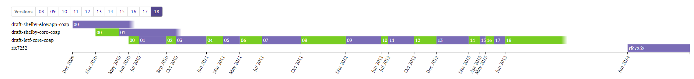
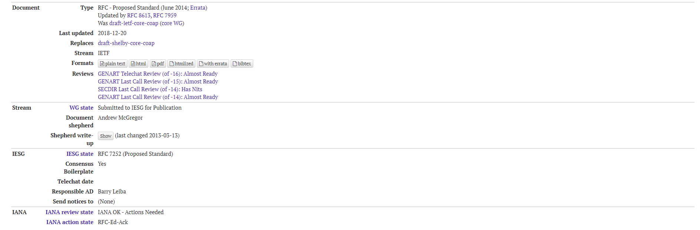

# [The Constrained Application Protocol (CoAP)](http://www.rfc-editor.org/info/rfc7252)

```
RFC 7252
```

## RFC 7252 文档官网

- [RFC 7252 主页](http://www.rfc-editor.org/info/rfc7252)
- [RFC 7252 文档主页](https://datatracker.ietf.org/doc/rfc7252/)

    这里介绍了 RFC 7252 文档的修订历史。

    

## 说明

本仓库汇总提交了 2018-12-20 更新的版本文档，包括 HTML 格式、TXT 格式、PDF 格式。



## 链接

- [CoAP 官网](http://coap.technology/)
